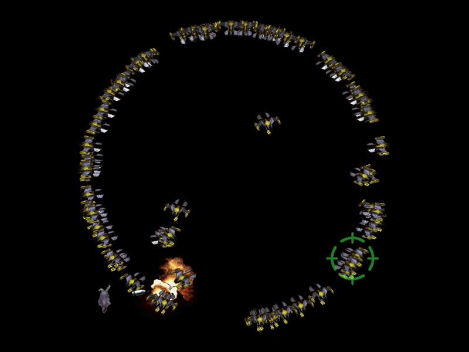

# Jako

===============

##0.  들어가기 전에   
동아리 여름방학 프로젝트로 만든 게임입니다.  
모티브가 된 게임은 동인서클 귤즙(橙汁)의 동인게임 스구리 시리즈와 소라. 그리고 Avoid N Survive입니다.   
스테이지 모티브는 당시 유행하던 스타크래프트 유즈맵 하늘에서 떨어지는 1억개의 별, 그리고 몇가지 개인적인 아이디어 입니다.  

- - -

##1. 소개 및 기능   
처음 제작한 슈팅게임입니다.   

2D 슈팅게임 하면 보통 생각나는 횡스크롤/종스크롤 게임이 아니라 정해진 패턴의 스테이지를 클리어하는 것이 목적입니다.   

- - -

##2. 사용 키     
방향키와 Z, X, C키를 사용합니다.

- - -

##3. 현재 시점에서의 감상    
제작 모티브는 적절했던 것 같습니다. 프로토타입을 제가 플레이하면서도 나름 재밌었던 것으로 기억합니다.   

다만 문제는 스테이지 제작 구상이었던 것 같습니다. 기억하기로는 당시에는 스테이지를 20~25개 정도 구현할 계획이었는데, 소재를 생각하는 것이 어려워 스테이지를 3개 정도 만들고 그만뒀던 걸로 기억합니다.        

그 외에도 본인의 디자인 센스?의 심각함을 느낄 수 있었습니다. 외부에서 가져온 리소스에 비해 직접 제작한 그림 같은게 맘에 안 들었던 것도 제작을 그만둔 이유 중 하나이지 않을까 합니다.

- - -

##4. Release Note   
>2014년 8월 첫 제작?